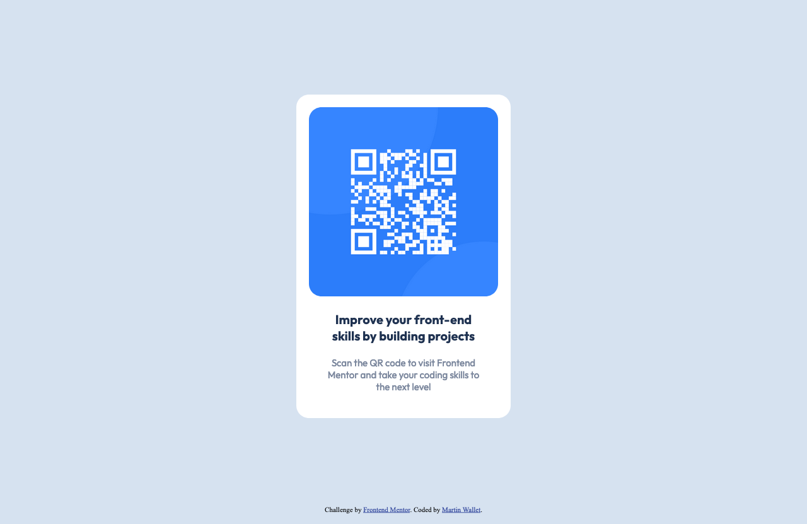

# Frontend Mentor - QR code component solution

This is a solution to the [QR code component challenge on Frontend Mentor](https://www.frontendmentor.io/challenges/qr-code-component-iux_sIO_H). Frontend Mentor challenges help you improve your coding skills by building realistic projects. 

## Table of contents

- [Overview](#overview)
  - [Screenshot](#screenshot)
  - [Links](#links)
- [My process](#my-process)
  - [Built with](#built-with)
  - [What I learned](#what-i-learned)
  - [Continued development](#continued-development)
  - [Useful resources](#useful-resources)
- [Author](#author)  

## Overview

### Screenshot

### Links

- Solution URL: [GitHub repo](https://github.com/martinw0/challenge_qr)
- Live Site URL: [GitHub Pages](https://martinw0.github.io/challenge_qr/)

## My process

### Built with

- Semantic HTML5 markup
- CSS custom properties
- Mobile-first workflow

### What I learned

- How to set correctly the box sizes  
- How to edit the css properties for different devices  

### Continued development

- Learn the CSS grid and flexbox
- Mobile first workflow
- Progress on responsive design

### Useful resources

- [Media queries](https://openclassrooms.com/fr/courses/1603881-apprenez-a-creer-votre-site-web-avec-html5-et-css3/1607616-utilisez-le-responsive-design-avec-les-media-queries) - This helped me for mobile design.

## Author

- Frontend Mentor - [@martinw0](https://www.frontendmentor.io/profile/martinw0)
- Twitter - [@LeWalletM](https://www.twitter.com/LeWalletM)

